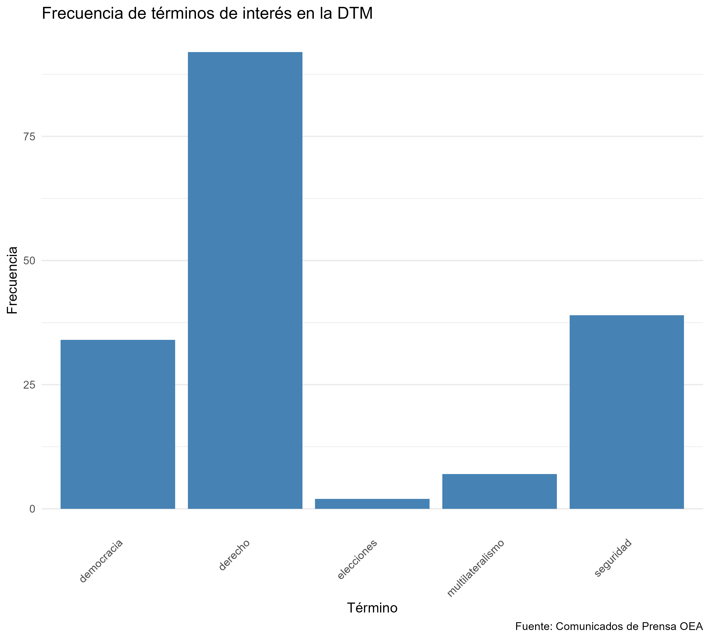

# Introducción

El presente trabajo tuvo como objetivo realizar un proceso de *web scraping* sobre los comunicados de prensa publicados por la Organización de los Estados Americanos (OEA) correspondientes a los meses de enero, febrero, marzo y abril de 2026. A partir de esta información, se construyó una base de datos textual para aplicar técnicas de procesamiento de lenguaje natural y explorar cuáles son los temas más relevantes presentes en la comunicación institucional del organismo.

Sobre esta línea de investigación es importante aclara que la OEA es una organización internacional regional dedicada a la promoción de la democracia, los derechos humanos, la seguridad y la cooperación entre los Estados del continente americano. Por lo tanto, el análisis de sus comunicados permite observar cuáles son las prioridades políticas e institucionales en un período determinado.

```{r}
library(here) 
# Ejecutar cada etapa en orden 
source(here("TP2/scripts/scraping_oea.R")) 
source(here("TP2/scripts/processing.R")) 
source(here("TP2/scripts/metrics_figures.R"))
```

# **Pregunta de investigación**

¿Qué temas aparecen con mayor frecuencia en los comunicados oficiales de la OEA durante los meses de enero, febrero, marzo y abril primer cuatrimestre de 2026?

# Estructura del proyecto

**/TP2/data**: Carpeta destinada a almacenar:

-   Archivos .html descargados desde la página oficial de la OEA.

-   Archivo .rds con la base tabular original obtenida mediante scraping.

**/TP2/output**: Carpeta donde se guardaron los productos finales del análisis:

-   Archivo .rds con el texto procesado.

-   Figura frecuencia_terminos.png.

**/TP2/scripts**: Contiene tres scripts principales.

**scraping_oea.R.** Script encargado de:

-   Acceder a los comunicados de enero a abril de 2026.

-   Extraer información relevante.

-   Construir una tabla con las variables: id, titulo, cuerpo.

**processing.R.** Script dedicado al preprocesamiento textual:

-   Eliminación de signos de puntuación, números y caracteres especiales.

-   Conversión a minúsculas.

-   Lematización del texto.

-   Conservación únicamente de sustantivos, verbos y adjetivos.

-   Remoción de stopwords.

**metrics_figures.R**. Script final del análisis:

-   Construcción de la Document-Term Matrix (DTM).

-   Cálculo de frecuencia total de cinco términos seleccionados.

-   Generación del gráfico final.

**/TP2/notebooks**: Contiene este informe en formato Quarto.

# Análisis: 

Se seleccionaron cinco términos considerados conceptualmente relevantes para el rol institucional de la OEA:

1.  democracia

2.  elecciones

3.  derecho

4.  multilateralismo

5.  seguridad

Estos conceptos representan áreas centrales de acción del organismo las cuales abarcan defensa democrática, observación electoral, promoción de derechos, cooperación internacional, seguridad hemisférica. **El objetivo** fue identificar cuál de estas dimensiones recibió mayor énfasis en los comunicados oficiales del período analizado.

# Resultados

## Frecuencia de términos de interés



Acá podemos observar que:

**derecho** es el término más frecuente, con amplia diferencia respecto del resto. Esto sugiere que durante el período analizado la OEA puso especial énfasis en cuestiones vinculadas a los derechos humanos, Estado de derecho, justicia institucional y marcos normativos.

**seguridad** aparece en segundo lugar. Esto indica una agenda relevante asociada a seguridad regional, crimen organizado, estabilidad política o cooperación en materia de defensa y protección ciudadana.

**democracia** presenta una frecuencia intermedia. Aunque es un valor central de la organización, en estos meses tuvo menor presencia explícita que derechos y seguridad.

**multilateralismo** registra pocas menciones. Esto puede deberse a que la cooperación internacional está implícita en muchos comunicados, aunque no siempre nombrada directamente.

**elecciones** es el término menos frecuente. Posiblemente porque en esos meses no hubo una concentración importante de procesos electorales observados por la OEA.

# Conclusión

El análisis textual sugiere que, entre enero y abril de 2026, la comunicación institucional de la OEA estuvo más orientada hacia temas de derechos y seguridad, mientras que conceptos como democracia electoral y multilateralismo tuvieron una presencia menor. Esto permite inferir que la agenda del organismo durante ese período estuvo enfocada principalmente en responder a desafíos jurídicos, institucionales y de seguridad regional, más que en procesos electorales específicos. Asimismo, el trabajo demuestra cómo técnicas de *web scraping,* procesamiento de texto y visualización de datos permiten transformar documentos institucionales en evidencia empírica útil para el análisis político.
